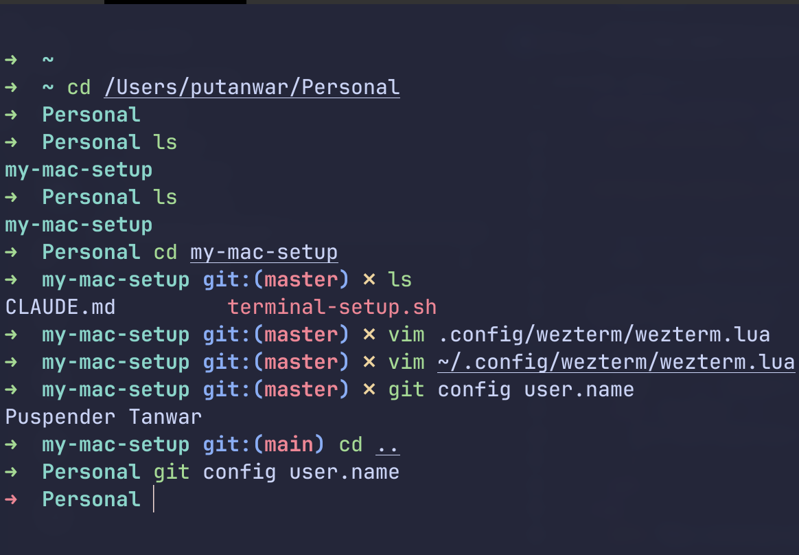
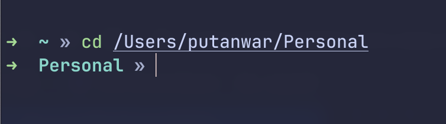

# my-mac-setup

A growing collection of **idempotent** macOS setup scripts for provisioning a fresh
(or existing) developer machine. Each script owns one concern, checks state before it
acts, and is **safe to re-run** — nothing is ever installed, cloned, or appended twice.

Today the repo provisions a **terminal environment**, a **Java toolchain**, and a
common set of **developer tools**. It will expand over time to cover IDEs, editors, and
other language runtimes (see [Roadmap](#roadmap)).

## Available setups

| Setup        | Script                                   | What it does                                                                                      |
|--------------|------------------------------------------|---------------------------------------------------------------------------------------------------|
| **Terminal** | [`terminal-setup.sh`](terminal-setup.sh) | Homebrew, WezTerm, git, Oh My Zsh + plugins, optional Powerlevel10k, WezTerm config               |
| **Java**     | [`java-setup.sh`](java-setup.sh)         | `jenv` + Amazon Corretto JDKs, jenv shell wiring, optional truststore certs                       |
| **Devtools** | [`devtools-setup.sh`](devtools-setup.sh) | Maven, Docker Desktop, Bruno, git, AWS CLI, and dive via Homebrew                                 |
| **Python**   | [`python-setup.sh`](python-setup.sh)     | `pyenv` + build deps, pyenv shell wiring, the Python versions you choose, optional global default |

Each script is standalone — run only the ones you need, in any order.

## Requirements

- macOS (Apple Silicon or Intel).
- `zsh` as your shell (the macOS default).
- An internet connection.
- Administrator rights — **only** where noted per script.

---

## Terminal setup

[`terminal-setup.sh`](terminal-setup.sh) provisions a
[WezTerm](https://wezfurlong.org/wezterm/) terminal: Homebrew, WezTerm, git,
[Oh My Zsh](https://ohmyz.sh/), the `zsh-autosuggestions` and
`zsh-syntax-highlighting` plugins, and (optionally) the
[Powerlevel10k](https://github.com/romkatv/powerlevel10k) prompt.

### What it sets up

| Component                   | Notes                                                                                               |
|-----------------------------|-----------------------------------------------------------------------------------------------------|
| **Homebrew**                | Installed only if missing — the one step that needs `sudo`.                                         |
| **WezTerm**                 | `brew install --cask wezterm` (skipped if already present).                                         |
| **git**                     | Installed via Homebrew if not already available.                                                    |
| **Oh My Zsh**               | Unattended install; does **not** change your login shell or open a new shell.                       |
| **zsh-autosuggestions**     | Cloned into `$ZSH_CUSTOM/plugins` and added to your `plugins=(…)`.                                  |
| **zsh-syntax-highlighting** | Same — and kept **last** in the plugin list (it must load last).                                    |
| **Powerlevel10k**           | Optional (you're prompted). Also installs the MesloLGS Nerd Font.                                   |
| **WezTerm config**          | Copies `wezterm.lua` from the repo to `~/.config/wezterm/wezterm.lua` (skipped if already present). |

### Usage

```sh
chmod +x terminal-setup.sh
./terminal-setup.sh
```

The script pauses for input at two points:

1. **Preflight gate** — it prints what it found (Homebrew present? is `sudo` needed?)
   and waits for you to press **Enter**, or **Ctrl-C** to abort.
2. **Powerlevel10k** — a `y/N` prompt asking whether to install the theme.

If Homebrew is missing, the script explains why it needs your password, caches it up
front with `sudo -v`, and keeps it warm in the background for the duration of the run
(the keep-alive is torn down automatically when the script exits).

### After it runs

- **Restart WezTerm** (or open a new tab/window). Changes to `~/.zshrc` apply to new
  shells — the script never `source`s it for you.
- If you installed **Powerlevel10k**:
  - Run `p10k configure` in a new shell to build your prompt.
  - Set a Nerd Font in your `~/.wezterm.lua` so the icons render, e.g.:
    ```lua
    config.font = wezterm.font("MesloLGS NF")
    ```
- If Homebrew was **freshly installed**, add it to your `PATH` for future shells (the
  script prints the exact line), e.g.:
  ```sh
  echo 'eval "$(/opt/homebrew/bin/brew shellenv)"' >> ~/.zprofile
  ```

At the end, the script prints a summary of what was **installed**, what was **skipped**,
and every **file it created or modified** so you can see exactly what changed.

---

## Java setup

[`java-setup.sh`](java-setup.sh) installs [`jenv`](https://www.jenv.be/), installs the
[Amazon Corretto](https://aws.amazon.com/corretto/) JDK versions you choose via Homebrew
casks, registers each with jenv, and wires jenv into your `~/.zshrc` so you can switch
Java versions per-shell or per-project. It can also import custom certificates into each
JDK's truststore.

### What it sets up

| Component                  | Notes                                                                                                                                               |
|----------------------------|-----------------------------------------------------------------------------------------------------------------------------------------------------|
| **jenv**                   | Installed via Homebrew if missing.                                                                                                                  |
| **jenv shell integration** | Adds a guarded `# >>> jenv setup >>>` block to `~/.zshrc` (never duplicated).                                                                       |
| **Corretto JDKs**          | You pick the major versions (e.g. `11,17,21,25`); each valid `corretto@N` cask is installed. Versions with no matching cask are logged and skipped. |
| **jenv registration**      | Each installed JDK is resolved via `/usr/libexec/java_home` and added with `jenv add`.                                                              |
| **export plugin**          | Enables the jenv `export` plugin so `JAVA_HOME` follows the active jenv version automatically.                                                      |
| **Truststore certs**       | Optional (you're prompted). Imports every `.crt` in a folder you choose into each JDK's `cacerts` (requires `sudo`).                                |

### Usage

```sh
chmod +x java-setup.sh
./java-setup.sh
```

The script prompts you for:

1. **Corretto versions** — comma-separated major versions (e.g. `11,17,21,25`).
2. **Certificate import** — a `y/N` prompt; if `y`, it asks for a folder of `.crt`
   files to import into the JDK truststores (needs your password for `sudo`).

### After it runs

- **Open a new terminal** (or `source ~/.zshrc`) so the jenv integration takes effect.
- Set a global default: `jenv global 21`
- Pin a version per project: `cd my-project && jenv local 17`
- Confirm: `java -version`

Because the export plugin is enabled, `JAVA_HOME` tracks the active jenv version
automatically once you restart your shell.

**Docs:** [jenv](https://www.jenv.be/)

---

## Devtools setup

[`devtools-setup.sh`](devtools-setup.sh) installs a common set of developer tools via
Homebrew. Anything already installed is logged and skipped, so it's safe to re-run.

### What it sets up

| Tool               | Package                    | Notes                                                                       |
|--------------------|----------------------------|-----------------------------------------------------------------------------|
| **Maven**          | `maven` (formula)          | Build tool for Java projects.                                               |
| **Docker Desktop** | `docker-desktop` (cask)    | GUI app — launch it once so the Docker daemon starts before using `docker`. |
| **Bruno**          | `bruno` (cask)             | Offline-first API client.                                                   |
| **git**            | `git` (formula)            | Installed via Homebrew if not already available.                            |
| **AWS CLI**        | `awscli` (formula)         | Provides the `aws` command.                                                 |
| **dive**           | `dive` (formula)           | Inspect Docker image layers (needs the Docker daemon running).              |

### Usage

```sh
chmod +x devtools-setup.sh
./devtools-setup.sh
```

The script takes no input. It checks each tool with `brew list` (or `brew list --cask`),
installs the ones that are missing, and continues past any single failure. At the end it
prints a summary of what was **newly installed**, **already present**, and **failed**.

### After it runs

- Launch **Docker Desktop** once from Applications (or `open -a "Docker"`) so the daemon
  starts before you use `docker` or `dive`.
- Confirm AWS CLI: `aws --version`

---

## Python setup

[`python-setup.sh`](python-setup.sh) installs [`pyenv`](https://github.com/pyenv/pyenv),
installs the Python versions you choose, and wires pyenv into your `~/.zshrc` so you can
switch Python versions per-shell or per-project — the Python equivalent of the Java
(`jenv`) setup. Because pyenv **compiles CPython from source**, the required build
dependencies are installed first.

### What it sets up

| Component                   | Notes                                                                                                                                                                   |
|-----------------------------|-------------------------------------------------------------------------------------------------------------------------------------------------------------------------|
| **Build dependencies**      | `openssl`, `readline`, `sqlite3`, `xz`, `zlib`, `tcl-tk` via Homebrew (skipped if already present) — needed to compile CPython.                                         |
| **pyenv**                   | Installed via Homebrew if missing.                                                                                                                                      |
| **pyenv shell integration** | Adds a guarded `# >>> pyenv setup >>>` block to `~/.zshrc` (never duplicated).                                                                                          |
| **Python versions**         | You pick them (e.g. `3.11,3.12,3.13`); an `X.Y` is resolved to the latest patch. Each is built with `pyenv install`. Versions pyenv can't build are logged and skipped. |
| **Global default**          | Optional (you're prompted). Sets the first installed version as the global Python via `pyenv global`.                                                                   |

### Usage

```sh
chmod +x python-setup.sh
./python-setup.sh
```

The script prompts you for:

1. **Python versions** — comma-separated `X.Y` or `X.Y.Z` (e.g. `3.11,3.12,3.13`).
2. **Global default** — a `y/N` prompt to set the first installed version as your global
   Python.

### After it runs

- **Open a new terminal** (or `source ~/.zshrc`) so the pyenv integration takes effect.
- Set a global default: `pyenv global 3.12`
- Pin a version per project: `cd my-project && pyenv local 3.11`
- Confirm: `python --version`

pyenv shims are on your `PATH` via the setup block, so `python` follows the active pyenv
version once you restart your shell.

**Docs:** [pyenv](https://github.com/pyenv/pyenv)

---

## Roadmap

Planned setups:

- [ ] Terminal (WezTerm + Oh My Zsh)
- [ ] Java (`jenv` + Corretto)
- [ ] IntelliJ Toolbox for IDEs (Not required, install manually)
- [ ] VS Code (Not required, install manually)
- [ ] Obsidian (Not required, install manually)
- [x] Python (`pyenv`)
- [ ] Node.js
- [ ] Docker Desktop
- [ ] Maven
- [ ] Bruno
- [ ] git
- [ ] awscli
- [ ] dive

Devtools like docker-desktop, bruno, maven, git, awscli, dive are installed using `devtools-setup.sh` 

## What these scripts deliberately do NOT do

- Never create or modify **`~/.wezterm.lua`** — your WezTerm config is yours (the
  Powerlevel10k font tip is *printed*, never written).
- Never run **`chsh`** — your login shell is left untouched.
- Never **`source`** `~/.zshrc` — changes apply on your next shell.
- Only ask for **`sudo`** when genuinely required (installing Homebrew, or writing to a
  JDK truststore).

## Safety & rollback

There is no built-in uninstall, but the scripts leave clear restore points:

- Before editing `~/.zshrc`, the terminal script backs it up to
  `~/.zshrc.bak.<timestamp>` (once per run).
- On a first-time Oh My Zsh install, your original `~/.zshrc` is preserved by OMZ as
  `~/.zshrc.pre-oh-my-zsh`.

To revert manually:

- Restore a `~/.zshrc` backup (or `~/.zshrc.pre-oh-my-zsh`), or remove the guarded
  `# >>> jenv setup >>>` block.
- Remove cloned directories under `~/.oh-my-zsh/custom/plugins` and
  `~/.oh-my-zsh/custom/themes`.
- Uninstall Homebrew packages with `brew uninstall` / `brew uninstall --cask`.
- Remove a registered JDK from jenv with `jenv remove <version>`.

## Repository layout

```
.
├── terminal-setup.sh        # terminal environment setup
├── java-setup.sh            # jenv + Corretto Java setup
├── devtools-setup.sh        # developer tools (Maven, Docker Desktop, Bruno, git, AWS CLI, dive)
├── python-setup.sh          # pyenv + Python versions setup
├── wezterm.lua              # WezTerm config (copied by terminal-setup.sh)
├── checklist.md             # roadmap of planned setups
├── README.md                # this file
├── CLAUDE.md                # guidance for Claude Code / contributors
├── images/                  # screenshots used in this README
├── .gitignore
└── .claude/
    ├── settings.json        # shared, safe verification permissions
    └── settings.local.json  # per-machine, auto-generated (gitignored)
```

## Development

The scripts target the **stock macOS `/bin/bash` (3.2)** and must stay compatible with
it. Verify changes *without* running an installer end-to-end:

```sh
/bin/bash -n terminal-setup.sh   # syntax check on bash 3.2
/bin/bash -n java-setup.sh
/bin/bash -n devtools-setup.sh
/bin/bash -n python-setup.sh
shellcheck terminal-setup.sh     # if installed
```

See [CLAUDE.md](CLAUDE.md) for the full list of constraints, the gotchas already found,
and how to unit-test the `~/.zshrc`-editing functions in isolation.

## Key bindings

These are defined in `~/.config/wezterm/wezterm.lua`.

### Keyboard

| Shortcut        | Action                                  |
|-----------------|-----------------------------------------|
| `Cmd+T`         | New tab (opens at `~`)                  |
| `Cmd+W`         | Close current pane                      |
| `Cmd+Shift+W`   | Close current tab                       |
| `Cmd+D`         | Split pane horizontally (opens at `~`)  |
| `Cmd+Shift+D`   | Split pane vertically (opens at `~`)    |
| `Cmd+K`         | Clear scrollback and viewport           |
| `Cmd+F`         | Search (uses current selection if any)  |
| `Cmd+Shift+P`   | Open command palette                    |
| `Cmd+,`         | Open `wezterm.lua` in VS Code           |
| `Cmd+Shift+E`   | Rename current tab                      |
| `Cmd+A`         | Select semantic zone (smart select-all) |
| `Cmd+←`         | Move to beginning of line               |
| `Cmd+→`         | Move to end of line                     |
| `Cmd+Backspace` | Delete to beginning of line             |
| `Opt+Backspace` | Delete previous word                    |
| `Opt+←`         | Move one word backward                  |
| `Opt+→`         | Move one word forward                   |
| `Cmd+Q`         | Disabled (prevents accidental quit)     |

### Mouse

| Action           | Shortcut    |
|------------------|-------------|
| Open link        | `Cmd+Click` |
| Extend selection | `Cmd+Drag`  |

## Optional: terminal prompt separator

If WezTerm doesn't show any separator in between the path and the command (see image for
reference), then add the below line to `~/.zshrc` after `source $ZSH/oh-my-zsh.sh`.



```
PROMPT+='%{$fg_bold[white]%}»%{$reset_color%} '
```
Use icon of your choice, I am using »

After the fix:


> [!NOTE]
> **Disclaimer:** This shouldn't be needed for Powerlevel10k
